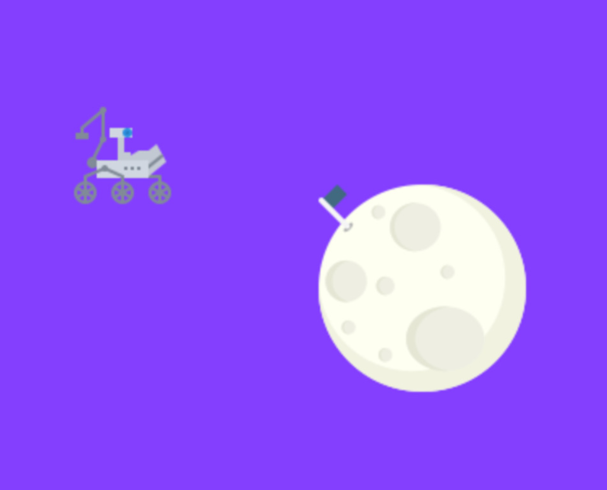
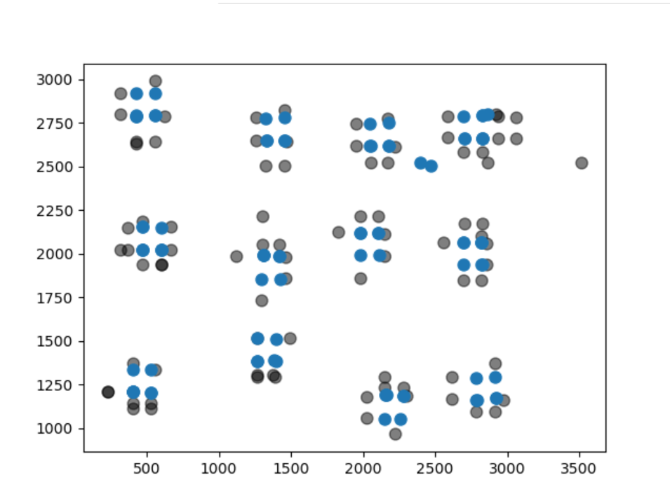

# PRE (Pygame Robot Exploration)
 

## What is PRE?
PRE is a python game designed to help developers learn how to write SLAM and other algorithms that are related to robotic mapping/exploration

There are several ways that PRE makes writing SLAM easier

1. All of the information you need is provided up front. For example, simply call the getSensorData() function and PRE will simulate the effect of having sensors on your robot

2. PRE comes with built in functions to help write a SLAM algorithm, this includes adding noise to your data as well as displaying your map using matpotlib

3. PRE comes with a build in SLAM algorithm so you don't have to start from scratch. If you get stuck on a certain part of SLAM you can always check the default to help you.

## Installing/Running PRE
1. Install the dependencies listed below
2. run the command ```git clone https://github.com/Brad1141/PygameRobotExploration.git```
3. Open the repo and run the file```main.py``` located in the ```/venv``` folder

## Dependencies
* Matplotlib
```pip install matplotlib```
* Pygame
```pip install pygame```

## More info
This project was originally part of a tutorial I made on how to make a simple game for robotic mapping. Feel free to check out the [tutorial series](https://roving-robots.com/2020/05/04/python-game-for-robot-exploration-part-1/) for more details on the methods and features used in PRE. 

